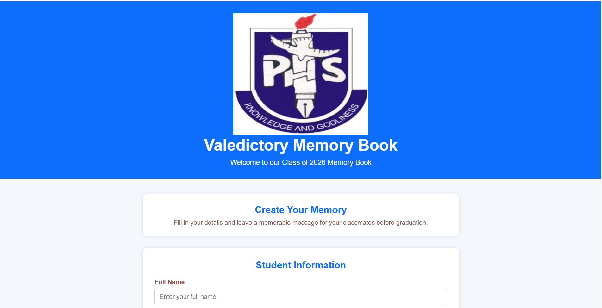
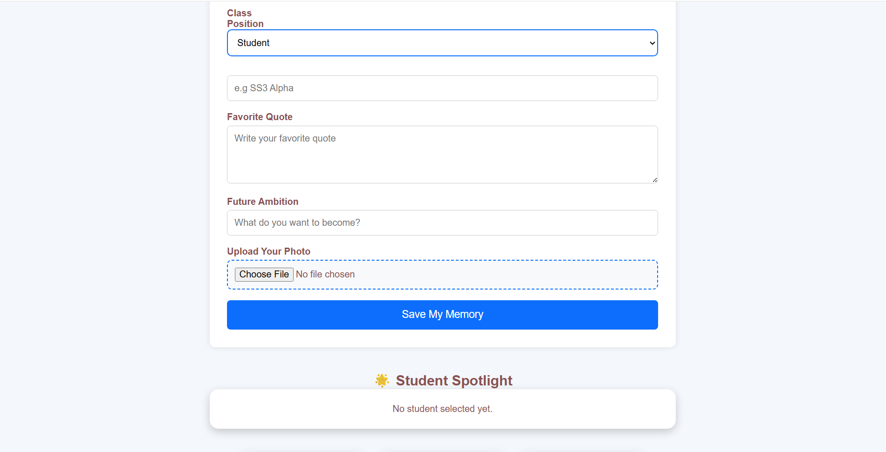
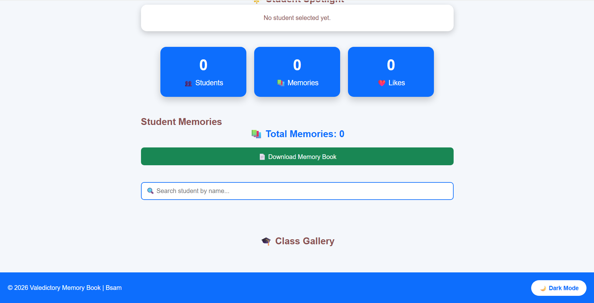

# 🎓 PHS Valedictory Memory Book

A modern digital memory book built for Providence High School's Class of 2026. Students can create and preserve their graduation memories by adding their personal information, favorite quotes, ambitions, and photos.

## 📌 Features

- ✍️ Add student memories
- 📝 Edit existing memories
- 🗑️ Delete memories
- ❤️ Like student memories
- 🔍 Search students by name
- 📊 Dashboard showing:
  - Total Students
  - Total Memories
  - Total Likes
- 🌟 Student Spotlight
- 🖼️ Class Gallery
- 📄 Download Memory Book as PDF
- 🌙 Dark Mode
- 📖 Welcome Cover Page
- 💾 Local Storage support (data persists in the browser)

## 🛠️ Technologies Used

- HTML
- CSS
- JavaScript
- Local Storage
- jsPDF

## 📷 Screenshots
### First Page

### Second Page

### Third Page

## 🚀 How to Run

1. Clone the repository

```bash
git clone https://github.com/Bsam-lab/Valecdictory_Memorial_Book.git
```

2. Open the project folder in VS Code.

3. Install the **Live Server** extension if you don't already have it.

4. Right-click `index.html` and select **Open with Live Server**.

## 📂 Project Structure

```
Valedictory-Memory-Book/
│
├── images/
├── screenshots
├── index.html
├── style.css
└── script.js
```

## 🎯 Future Improvements

- Firebase Cloud Database
- User Authentication
- Student Login
- Cloud Storage for Images
- Admin Dashboard
- Online Deployment
- Mobile App Version

## 👨‍💻 Author

**Bsam Team**

## 📜 License

This project is for educational purposes.
